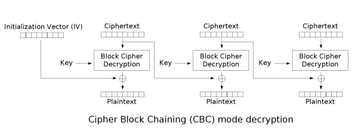
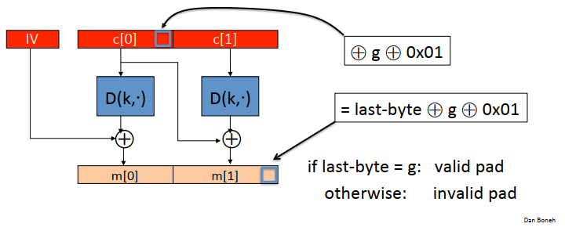

# Cryptopals
## [Set 1: Basics](https://cryptopals.com/sets/1)
### [Challenge 1: Convert hex to base64](https://cryptopals.com/sets/1/challenges/1)

Mục tiêu của bài này là chuyển xâu hex sang base64, nên ở đây mình sẽ sử dụng thư viện `base64` và `binascii`:

```py
msg = '49276d206b696c6c696e6720796f757220627261696e206c696b65206120706f69736f6e6f7573206d757368726f6f6d'
msg = binascii.a2b_hex(msg)
res = base64.b64encode(msg)
```

### [Challenge 2: Fixed XOR](https://cryptopals.com/sets/1/challenges/2)

Ta cần xor 2 xâu hex mà đề bài cho với nhau:

```py
def bxor(str1, str2):
    tmp =  bytes([x ^ y for (x, y) in zip(str1, str2)])
    return binascii.b2a_hex(tmp)
```

### [Challenge 3: Single-byte XOR cipher](https://cryptopals.com/sets/1/challenges/3)

Theo đề bài thì bản rõ đã được mã hóa bằng cách xor từng ký tự với 1 ký tự key, vì vậy để tìm được bản rõ ta chỉ cần thực hiện phép xor với khóa thêm 1 lần nữa. Vấn đề ở đây là tìm key, hay ký tự đó như thế nào? Ta có thể thử 256 ký tự, nhưng làm thế nào để biết được đâu là bản rõ cần tìm? Theo như gợi ý của đề bài, ta sẽ tự đặt ra 1 quy luật tính điểm: nếu ký tự của bản rõ tìm được là 1 ký tự có thể nhập được từ bàn phím thì cộng điểm, nếu không phải thì không cộng, cuối cùng chọn bản rõ đạt được nhiều điểm nhất tương ứng với key tìm được.

```py
def find_key(ciphertext):
    best = None
    for i in range(2 ** 8):
        ii = i.to_bytes(1, byteorder='big')
        key = ii * len(ciphertext)
        plaintext = cryptopals.bxor(key, ciphertext)
        score = sum(x in character for x in plaintext)
        if best == None or score > best['score']:
            best = {'plaintext': plaintext, 'score': score, 'key': key}
    return best
```

### [Challenge 4: Detect single-character XOR](https://cryptopals.com/sets/1/challenges/4)

Bài này sử dụng lại ý tưởng của bài 3, tuy nhiên thay vì chỉ có 1 bản mã thì sẽ có rất nhiều bản mã. Mục tiêu là phải tìm ra bản mã là mã hóa của bản rõ cần tìm. Vì vậy sau bước tính điểm giống như bài 3...

```py
def calc_score(data):
    best = {'score': 0, 'key': 0}
    for i in range(2 ** 8):
        score = 0
        for c in data:
            tmp = c ^ i
            if tmp in character:
                score += 1
        if best['score'] == 0 or score > best['score']:
            best['score'] = score
            best['key'] = i
    return best
```

... ta cần 1 bước nữa để chọn ra bản mã nào có điểm cao nhất:

```py
while True:
    data = fp.readline()
    if data == '':
        break
    data = data.strip()
    data = binascii.a2b_hex(data)
    l = len(data)
    best = calc_score(data)
    if super_score == 0 or best['score'] > super_score:
        super_score = best['score']
        key_to_encrypt = best['key']
        best_data = data
```

### [Challenge 5: Implement repeating-key XOR](https://cryptopals.com/sets/1/challenges/5)

Trong chall này ta sẽ phải mã hóa bản rõ bằng cách xor với key, trong đó key là 1 chuỗi các xâu `ICE` lặp lại nhiều lần.

```py
plaintext = b'''Burning 'em, if you ain't quick and nimble\nI go crazy when I hear a cymbal'''
k = b'ICE'
key = k * len(plaintext)
key = key[:len(plaintext)]
ciphertext = bytes([x ^ y for (x, y) in zip(plaintext, key)])
print(binascii.b2a_hex(ciphertext))
```

### [Challenge 6: Break repeating-key XOR](https://cryptopals.com/sets/1/challenges/6)

Challenge này yêu cầu giải mã một bản mã được mã hóa bằng phương thức repeating-key XOR, nhưng ở đây sẽ phức tạp hơn vì khóa chưa biết. Để ý thấy rằng với cách mã hóa này, cứ cách 1 khoảng byte với độ dài bằng độ dài khóa thì sẽ XOR với cùng 1 byte, ta sẽ đưa bài toán về bài toán trong chall 3 và 4. Như vậy, trước hết cần tìm được độ dài khóa.
Theo gợi ý đề bài, ta cần tính khoảng cách Hamming.

```py
def hamming_distance(s1, s2):
    return sum(bin(byte).count('1') for byte in cryptopals.bxor(s1, s2))
```

Ban đầu mình cũng không hiểu nó có tác dụng gì, nhưng ý tưởng là ở [đây](https://crypto.stackexchange.com/questions/8115/repeating-key-xor-and-hamming-distance/8118#8118). Về cơ bản, khoảng cách Hamming là số các cặp bit khác nhau giữa 2 chuỗi bit, và nếu như 2 chuỗi bit là biểu diễn của các đoạn chữ cái Tiếng Anh thì giá trị này sẽ là 2-3, trong khi ngược lại sẽ là 4.

```py
def break_repeated_xor(cipher: bytes, min_keysize=2, max_keysize=40):
    min_distance, current_min_keysize = None, None
    for keysize in range(min_keysize, max_keysize + 1):
        nb = min(len(cipher) // keysize, 4)
        blocks = []
        for i in range(nb):
            blocks.append(cipher[i * keysize : (i + 1) * keysize])
        distance = 0
        for i in range(nb):
            for j in range(i, nb):
                distance += hamming_distance(blocks[i], blocks[j])
        distance /= (keysize * nb * (nb - 1) / 2)
        if min_distance is None or min_distance > distance:
            min_distance, current_min_keysize = distance, keysize
    return current_min_keysize
```

Hàm bên trên tính luôn khoảng cách Hamming của bản mã??? Ở đây chỉ là một chút suy luận nhỏ thôi. Giả sử A, B là 2 bản rõ tương ứng với X, Y là 2 bản mã, ta có:

`X ⊕ K = A, Y ⊕ K = B => X ⊕ Y = A ⊕ B`

Cuối cùng là triển khai lại thuật toán tính điểm đối với các byte được XOR với cùng 1 byte-key:

```py
def find_key_xor(ciphertext):
    keysize = break_repeated_xor(ciphertext)
    key = bytes()
    message_parts = list()
    for i in range(keysize):
        part = cryptopals.calc_score(bytes(ciphertext[i::keysize]))
        key += part['key']
        message_parts.append(part['plaintext'])
    message = bytes()
    for i in range(max(map(len, message_parts))):
        message += bytes([part[i] for part in message_parts if len(part)>=i+1])
    return {'plaintext':message, 'key':key}
```

### [Challenge 7: AES in ECB mode](https://cryptopals.com/sets/1/challenges/7)

Bài này chỉ đơn giản là yêu cầu giải mã 1 đoạn văn bản đã được mã hóa bằng base64 ở chế độ ECB, và key thì đã biết T_T

```py
def decode_aes_ecb(ciphertext):
    key = b'YELLOW SUBMARINE'
    decipher = AES.new(key, AES.MODE_ECB)
    plaintext = decipher.decrypt(ciphertext)
    return plaintext
```

### [Challenge 8: Detect AES in ECB mode](https://cryptopals.com/sets/1/challenges/8)

Trong chall này đề bài cho rất nhiều bản mã và yêu cầu tìm bản mã nào được mã hóa bởi AES ECB mode. Như đã biết thì 1 bản rõ được mã hóa bởi chế độ ECB sẽ có đặc điểm: những byte giống nhau sẽ được mã hóa giống nhau. Vì vậy ý tưởng sẽ là duyệt tất cả các bản mã, sau đó chia mỗi bản mã thành các block và xét xem có sự lặp lại của block nào hay không.

```py
def has_repeated_block(line, block_size = 16):
    if len(line) % block_size != 0:
        print('Error length')
        exit(0)
    else:
        num_block = len(line) // block_size
    blocks = [line[i * block_size : (i + 1) * block_size] for i in range(num_block)]
    if len(set(blocks)) != num_block:
        return True
    else:
        return False
```

## [Set 2: Block crypto](https://cryptopals.com/sets/2)

### [Challenge 9: Implement PKCS#7 padding](https://cryptopals.com/sets/2/challenges/9)

Có 1 vấn đề xuất hiện khi mã hóa bởi chế độ ECB hay CBC là kích thước bản rõ có thể không chia hết cho 16 byte (128 bit). Khi đó ta cần thêm vào 1 phần đệm. PKCS#7 là 1 quy tắc thêm phần đệm, trong đó:

- Nếu kích thước bản rõ không chia hết cho 16 byte thì số byte được thêm vào là `n = 16 - len(msg) mod 16`, với giá trị mỗi byte là `n`.
- Nếu kích thước bản rõ chia hết cho 16 byte thì thêm vào 1 block.

```py
def pkcs7(message, block_size):
    padding_length = block_size - len(message) % block_size
    padding = bytes([padding_length]) * padding_length
    return message + padding
```

### [Challenge 10: Implement CBC mode](https://cryptopals.com/sets/2/challenges/10)

Chall này yêu cầu mình giải mã theo chế độ CBC nhưng dùng lại hàm ECB?? Đầu tiên hãy nhìn lại sơ đồ giải mã CBC:



Ở đây có 1 hàm decrypt, do vậy ECB chính là ở hàm giải mã này.

```py
def AES_decrypt(key: bytes, cipher: bytes, mode: str) -> bytes:
    cryptor = AES.new(key, AES.MODE_ECB)
    last_block = b'\x00' * 16
    decrypted = b''
    for i in range(0, len(cipher), 16):
        decrypted += cryptopals.bxor(cryptor.decrypt(cipher[i : i + 16]), last_block)
        if mode == 'cbc':
            last_block = cipher[i : i + 16]
    return decrypted
```

### [Challenge 11: An ECB/CBC detection oracle](https://cryptopals.com/sets/2/challenges/11)

Yêu cầu của chall này là mã hóa bản rõ bằng chế độ ECB hoặc CBC (chọn 1 trong 2 chế độ một cách ngẫu nhiên) và đưa ra dự đoán xem bản mã là mã hóa của bản rõ theo chế độ nào. Mình sẽ dùng lại ý tưởng detect ECB mode ở challenge 8.
Hàm mã hóa:

```py
def AES_encrypt(key: bytes, plain: bytes, mode: str) -> bytes:
    cryptor = AES.new(key, AES.MODE_ECB)
    last_block = b'\x00' * 16
    encrypted = b''
    for i in range(0, len(plain), 16):
        last_block = cryptor.encrypt(cryptopals.bxor(plain[i : i + 16], last_block))
        encrypted += last_block
        if mode == 'ecb':
            last_block = b'\x00' * 16
    return encrypted
```

Sinh khóa, message ngẫu nhiên và hàm oracle:

```py
def generate_key(length: int = 16) -> bytes:
    return bytes([randint(0, 255) for _ in range(length)])

def encryption_oracle(s: bytes) -> bytes:
    mode = 'ecb' if randint(0, 1) == 0 else 'cbc'
    s = generate_key(randint(5, 10)) + s + generate_key(randint(5, 10))
    s = cryptopals.pkcs7(s, 16)
    return AES_encrypt(generate_key(), s, mode), mode
```

Vì ý tưởng detect ECB mode đã được triển khai ở challenge 8 với các đoạn text ngẫu nhiên, nên ở challenge này để đơn giản hóa thì mình sẽ chọn bản rõ đơn giản hơn bao gồm 48 ký tự `a`:

```py
for _ in range(100):
    cipher, mode = encryption_oracle(b'a'* (16 * 3))
    if cipher[16:32] == cipher[32:48]:
        if mode != 'ecb':
            print('wrong')
    else:
        if mode != 'cbc':
            print('wrong')
```

### [Challenge 12: Byte-at-a-time ECB decryption (Simple)](https://cryptopals.com/sets/2/challenges/12)

Yêu cầu của challenge này là tìm ra `unknown-string` mà không được decode trực tiếp bằng base64. Tưởng tượng rằng có 1 server được cài đặt 1 thuật toán mã hóa nào đó, ta gửi input lên server đó, sau đó input sẽ được nối với `unknown-string` và đưa vào hàm mã hóa.

```py
def AES_encrypt_ecb(my_string):
    plaintext = my_string + unknown_string
    plaintext = cryptopals.pkcs7(plaintext, 16)
    cryptor = AES.new(random_key, AES.MODE_ECB)
    ciphertext = cryptor.encrypt(plaintext)
    return ciphertext
```

Bây giờ mình sẽ follow theo gợi ý trong đề bài.

- Bước 1: Tìm `block_size`
Ý tưởng của bước này là thử lần lượt input với cùng 1 byte nhưng có độ dài tăng dần. Giả sử ở lần thử thứ n ta có độ dài input là n, nhận được bản mã là `c`, ở lần thử thứ n+1 nhận được bản mã là `c'`. Vì thuật toán mã hóa là mật mã khối, nên nếu như n byte đầu của `c'` giống vói n byte đầu của `c` thì `block_size = n`. Kết quả nhận được là 16.

```py
def guess_block_size():
    block_size = 1
    old_string = b'a' * block_size
    old_ciphertext = AES_encrypt_ecb(old_string)
    while True:
        block_size += 1
        new_string = b'a' * block_size
        new_ciphertext = AES_encrypt_ecb(new_string)
        if new_ciphertext[: block_size - 1] == old_ciphertext[: block_size - 1]:
            break
        else:
            old_ciphertext = new_ciphertext
    return block_size - 1
```

- Bước 2: Detect ECB mode
Phần này mình đã làm ở challenge 8, nên ở đây để đơn giản mình sẽ set input là 32 chữ cái `a`.

```py
def detect_ecb_mode(block_size):
    my_string = b'a' * (2 * block_size)
    ciphertext = AES_encrypt_ecb(my_string)
    if ciphertext[0 : block_size] == ciphertext[block_size : block_size * 2]:
        return True
    else:
        return False
```

- Bước 3 -> 6:
Ý tưởng tìm lần lượt từng ký tự của `unknown-string` chính là brute force, nhưng bằng cách hiệu quả hơn. Ta sẽ thay ký tự cuối cùng của xâu input lần lượt bằng các ký tự có thể nhập được từ bàn phím, từ nhận được các bản mã tương ứng, gọi chung là `c`. Mặt khác, ta sẽ bỏ luôn ký tự cuối cùng đó đi và đưa vào hàm mã hóa, được bản mã `c'`. Điều đặc biệt là, `c'` chính là mã hóa của phần còn lại của xâu input và ký tự đầu tiên của `unknown-string`. Do đó so sánh `c'` với `c` ta sẽ có được ký tự cần tìm.

```py
def crack():
    printable = string.printable

    len_target_bytes = 144
    target_bytes = ''

    for i in range(len_target_bytes):
        attacker_controlled = b'a' * (len_target_bytes - i - 1)
        ciphertext = AES_encrypt_ecb(attacker_controlled)

        for c in printable:
            brute_force_attacker_controlled = attacker_controlled + bytes(target_bytes, 'ascii') + bytes(c, 'ascii')
            brute_force_ciphertext = AES_encrypt_ecb(brute_force_attacker_controlled)
            if brute_force_ciphertext[128:144] == ciphertext[128:144]:
                target_bytes += c
                break
    return target_bytes
```

### [Challenge 15: PKCS#7 padding validation](https://cryptopals.com/sets/2/challenges/15)

Challenge này yêu cầu viết hàm kiểm tra xem padding có hợp lệ hay không. Như đã biết, quy tắc thêm phần đệm của PKCS#7 là thêm vào `n` byte, mỗi byte có giá trị là `n`. Do vậy, mình sẽ kiểm tra byte cuối cùng để biết độ dài của padding, sau đó kiểm tra lần lượt các byte còn lại.

```py
def is_valid_padding(msg):
    padding_length = msg[-1]
    l = len(msg)
    i = l - 1
    while(i >= l - padding_length):
        if msg[i] != padding_length:
            return False
        else:
            i -= 1
    return True
```

## [Set 3: Block & stream crypto](https://cryptopals.com/sets/3)

### [Challenge 17: Padding oracle](https://cryptopals.com/sets/3/challenges/17)

Nhắc lại 1 chút về chế độ CBC của mật mã khối:


Padding oracle, là hình thức tấn công (có lẽ) bắt nguồn từ 1 lỗi của giao thức TLS, khi mà giao thức sẽ trả về lỗi `padding error` nếu như phần đệm không hợp lệ (sau này đã được fix). Vậy attacker lợi dụng thông báo lỗi đó như thế nào?



Theo sơ đồ trên, để tìm byte cuối cùng của `m[1]`, attacker sẽ đoán nó có giá trị là `g`, sau đó xor byte cuối cùng của `c[0]` với `g xor 0x01`. Do đó, khi giải mã kết quả của byte cuối cùng của `m[1]` là phép xor giữa giá trị đúng và `g xor 0x01`. Thông báo lỗi như mình đã nói ở trên sẽ được lợi dụng ở bước này. Bằng việc quan sát xem có lỗi phần đệm không hợp lệ hay không, attacker sẽ biết được giá trị mà mình đoán có đúng hay không.

Tưởng tượng kịch bản trong chall này như sau: có 3 nhân vật bao gồm client, server và attacker. Ở phía server sẽ được triển khai 2 hàm bao gồm hàm mã hóa CBC và hàm check valid padding. Sau khi client gửi bản rõ lên server yêu cầu mã hóa, server gửi trả lại bản mã cho client. Trong quá trình này, attacker bằng cách nào đó nghe trộm được bản mã gửi về và hắn ta cố gắng giải mã nó bằng padding oracle và lợi dụng hàm thứ 2 trên server.

Hàm check valid padding:

```py
def is_valid_padding(msg):
    padding_length = msg[-1]
    l = len(msg)
    i = l - 1
    while(i >= l - padding_length):
        if msg[i] != padding_length:
            return False
        else:
            i -= 1
    return True
```

Brute force từng byte trong 1 block:

```py
for block in blocks:
    res = b''
    for k in range(15, -1, -1):
        len_padding = 16 - k
        padding = bytes([len_padding]) * len_padding
        real_data = iv[k:]
        for j in range(256):
            candidate = bytes([j]) + res
            fake_data = cryptopals.bxor(cryptopals.bxor(real_data, candidate), padding)
            iv = iv[:k] + fake_data
            tmp = AES_decrypt_cbc(block, iv)
            if is_valid_padding(tmp):
                res = candidate
                break
            else:
                continue
    iv = block
```

### [Challenge 18: Implement CTR, the stream cipher mode](https://cryptopals.com/sets/3/challenges/18)

Challenge này yêu cầu triển khai chế độ CTR của mật mã khối:

```py
def AES_decrypt_ctr(key, cipher, iv = b'\x00' * 8, nonce = 0):
    ret = b''
    for i in range(0, len(cipher), 16):
        block = cipher[i : i + 16]
        real_iv = (binascii.a2b_hex(f'{nonce:016x}') + iv)[::-1]
        ret += cryptopals.bxor(block, cryptopals.AES_encrypt(real_iv, key))
        nonce += 1
    return ret
```

### [Challenge 19: Break fixed-nonce CTR mode using substitutions](https://cryptopals.com/sets/3/challenges/19)

### [Challenge 20: Break fixed-nonce CTR statistically](https://cryptopals.com/sets/3/challenges/20)

## [Set 4: Stream crypto and randomness](https://cryptopals.com/sets/4)

### [Challenge 25: Break "random access read/write" AES CTR](https://cryptopals.com/sets/4/challenges/25)

Challenge yêu cầu viết 1 hàm API nhận đầu vào là văn bản [this file](https://cryptopals.com/static/challenge-data/25.txt), thay đổi nội dung văn bản với 2 tham số là `offset` và `newtext`, cuối cùng mã hóa lại bằng chế độ CTR và trả về bản mã. Mục tiêu của attacker là chỉ dùng API này để tìm ra bản rõ ban đầu.
Đầu tiên thì mình triển khai hàm CTR và API `edit()`:

```py
def AES_decrypt_encrypt_ctr(key, text, iv = b'\x00' * 8, nonce = 0):
    ret = b''
    for i in range(0, len(text), 16):
        block = text[i : i + 16]
        real_iv = (binascii.a2b_hex(f'{nonce:016x}') + iv)[::-1]
        ret += cryptopals.bxor(block, cryptopals.AES_encrypt(real_iv, key))
        nonce += 1
    return ret

def edit(offset, newtext):
    fake_plaintext = plaintext[:offset] + newtext + plaintext[offset + len(newtext) :]
    fake_ciphertext = AES_decrypt_encrypt_ctr(random_key, fake_plaintext)
    return fake_ciphertext
```

Vấn đề bây giờ là sử dụng hàm `edit()` như thế nào. Nhận thấy bản rõ có thể tìm được bằng cách xor bản mã với keystream, mình sẽ sử dụng hàm `edit()` để lấy được bản mã chuẩn và keystream là xong.

```py
real_ciphertext = edit(0, b'')
l = len(real_ciphertext)
keystream = edit(0, b'\x00' * l)
real_plaintext = cryptopals.bxor(real_ciphertext, keystream)
```